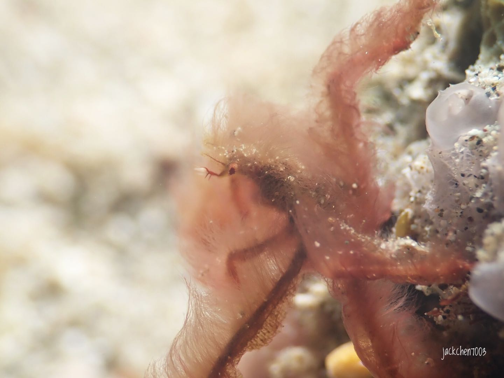

# About


**Click on the menu bar on top left area to see classify of the creature if you are using mobile phone. Click the search icon to use the searching function**


All the photos were posted in my instagram , Here is the link : [**Chenjacky7003**](https://www.instagram.com/jackchen7003/)\*\*\*\*

If the name of the creature is wrong, advices and suggestion is welcomed and I will fixed it.Also if you know the names of the creature in the group of "unknow" , please don't hesitate to tell me.

Here is my messenger:

Most of the details are from the websites below,it's really good website.

1: [**Tropical Reefs**](https://reefguide.org)\*\*\*\*

2: [**潜水时光**](http://www.lazydiving.com/report)\*\*\*\*

3: **reeflex**

