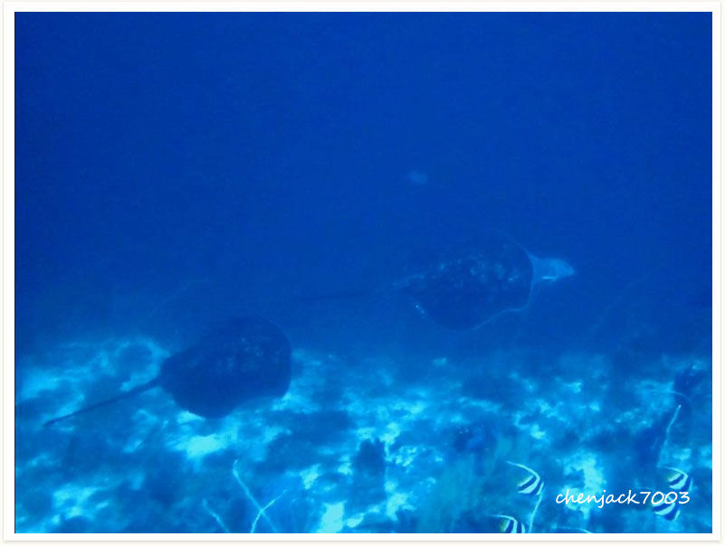
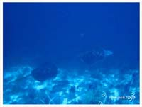

# 76:Taeniurops meyeni,Black-blotched Stingray, Giant Reef Ray, Round Ribbontail Ray

found in tubbataha philippines

#### Chinese name:黑斑条尾𛚉

| Thumbnail | Video Link |
| :---: | :---: |
|   | [video](https://drive.google.com/open?id=1rCCfQMFHXQJ2aED10ubSlpHe5avqTIBP) |

