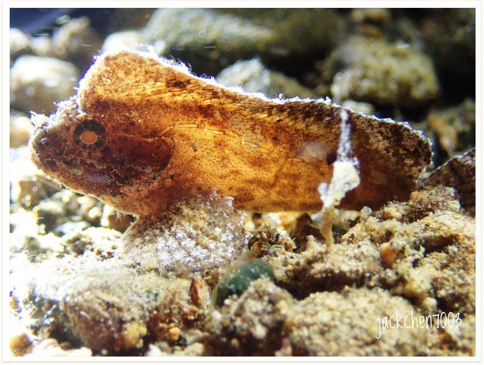

# 73:Ablabys macracanthus

#### Chinese name:  济公鱼、**长棘长绒鲉、大棘帆鳍鲉**、**狮子鱼**、**黑虎**

found in anilao

| Thumbnail | Video Link |
| :---: | :---: |
|   | [video](https://drive.google.com/open?id=1ADcDd-WxPi2L0XK3HCpY5ZeOdbLiQDp5) |

