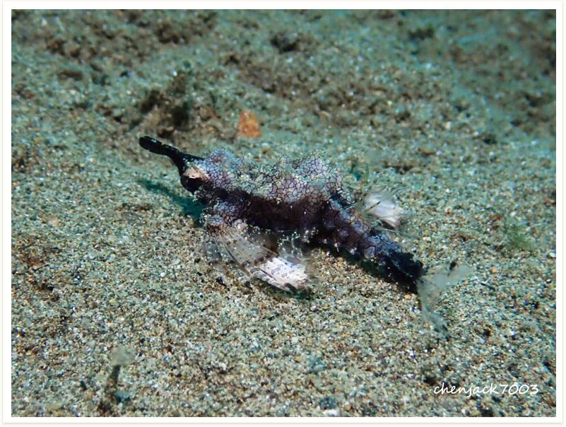

# 81:Eurypegasus draconis,Dwarf Seamoth, Little Dragonfish, Short Dragonfish, Short Seamoth

#### Chinese name: 宽海蛾鱼、海蛾鱼

found in anilao 

| Thumbnail | Video Link |
| :---: | :---: |
|   | [video](https://drive.google.com/open?id=1VBQ1dPuHv9i_7WHN_zqu2boZOVrLia43) |

