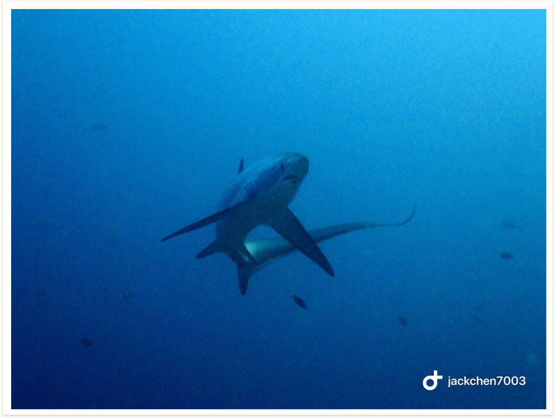
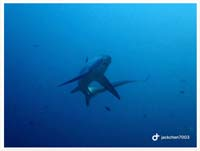

# 91:Alopias vulpinus, Thresher Shark

found in malapascua , philippines

#### Chinse name:细尾长尾鲨、狐形长尾鲨、狐鲛

| Thumbnail | Video Link |
| :---: | :---: |
|   | [video](https://drive.google.com/open?id=1eaTXwsaYyW6qnH9xnXhxcL3i83HUjW8l) |

