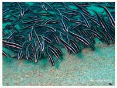

# Fish,Eel,Seastar Part 2

| Thumbnail | Link |
| :---: | :---: |
|   | [51:Bluefaced Angelfish,Pomacanthus xanthometopon](51-bluefaced-angelfish-pomacanthus-xanthometopon.md) |
|   | [52:Blackbacked Butterflyfish,Chaetodon melannotus](52-blackbacked-butterflyfish-chaetodon-melannotus.md) |
|   | [53:Pacific steephead parrotfish,Steephead parrotfish](53-pacific-steephead-parrotfish-steephead-parrotfish.md) |
|   | [54:Fire Goby,Nemateleotris magnifica](54-fire-goby-nemateleotris-magnifica.md) |
|   | [55:Peacock Grouper,Cephalopholis argus](55-peacock-grouper-cephalopholis-argus.md) |
|   | [56:False Stonefish,Scorpaenopsis diabolus](56-false-stonefish-scorpaenopsis-diabolus.md) |
|   | [57:Banded Thicklip,Barred Wrasse,Hemigymnus fasciatus](3-unknow.md) |
|   | [58:Aspidontus dussumieri,Dussumier's Blenny, Lance Blenny](58-aspidontus-dussumieri-dussumiers-blenny-lance-blenny.md) |
|    | [59:Dactyloptena orientalis,Flying Gurnard, Helmet Gurnard , Oriental Flying](59-dactyloptena-orientalis-flying-gurnard-helmet-gurnard-oriental-flying.md) |
|   | [60:Gorgasia maculata,Whitespotted garden eel](60-gorgasia-maculata-whitespotted-garden-eel.md) |
|   | [61:Striped eel catfish,Plotosus lineatus](61-striped-eel-catfish-plotosus-lineatus.md) |
|   | [62:Siokunichthys nigrolineatus,Mushroom-coral Pipefish](62-siokunichthys-nigrolineatus-mushroom-coral-pipefish.md) |
|   | [63:Pterois volitans,Red lionfish](63-pterois-volitans-red-lionfish.md) |
|   | [64:Dendrochirus zebra,Zebra Lionfish,Dwarf Lionfish,Zebra Turkeyfish](64-dendrochirus-zebra-zebra-lionfish-dwarf-lionfish-zebra-turkeyfish.md) |
|   | [65:Echeneis naucrates,Live Sharksucker](65-echeneis-naucrates-live-sharksucker.md) |
|   | [66:Plectorhinchus chaetodonoides,Harlequin Sweetlips](66-plectorhinchus-chaetodonoides-harlequin-sweetlips.md) |
|   | [67:Amphiprion perideraion,Pink Anemonefish,False Skunk-striped Anemonefish,Whitebanded Anemonefish](67-amphiprion-perideraion-pink-anemonefish-false-skunk-striped-anemonefish-whitebanded-anemonefish.md) |

