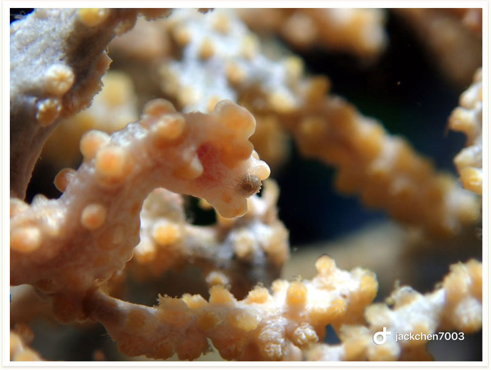
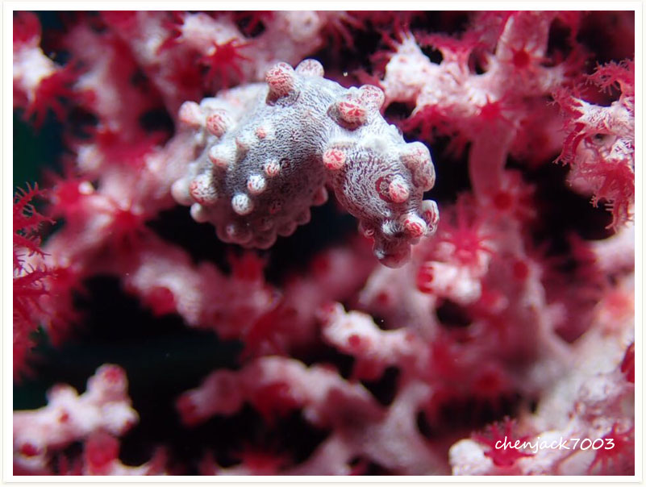

# 102:Hippocampus bargibanti,Pygmy Seahorse

#### Chinese name:巴氏豆丁海马

| Thumbnail | VideoLink | VideoLink |
| :---: | :---: | :---: |
|   | [video](https://drive.google.com/open?id=13DphrOYt4EsynKKfp3LlIDUZ38Vb3ODj) | [video2](https://drive.google.com/open?id=1j3Xv6DhjGldShGdVBJnfWm49aV6ipeXR) |

