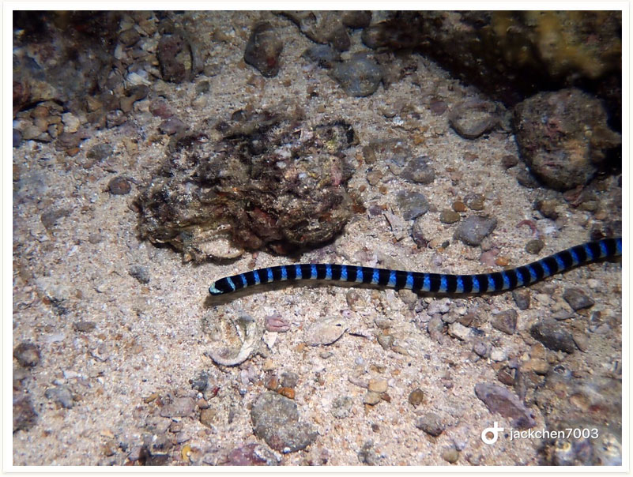
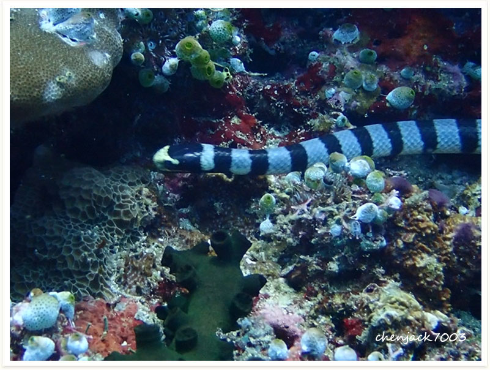

# 103:Hydrophis belcheri,Faint-banded Seasnake

#### Chinese name:贝尔彻海蛇

| Thumbnail | Video Link | VideoLink |
| :---: | :---: | :---: |
|   | [video](https://drive.google.com/open?id=1k2SPhj4TCowPuSEAbnHdnokPQcJxIrko) | [video](https://drive.google.com/open?id=1r7ACcJKo6BCTAK4kPTIGJ3ePn0z8v6Ty) |

