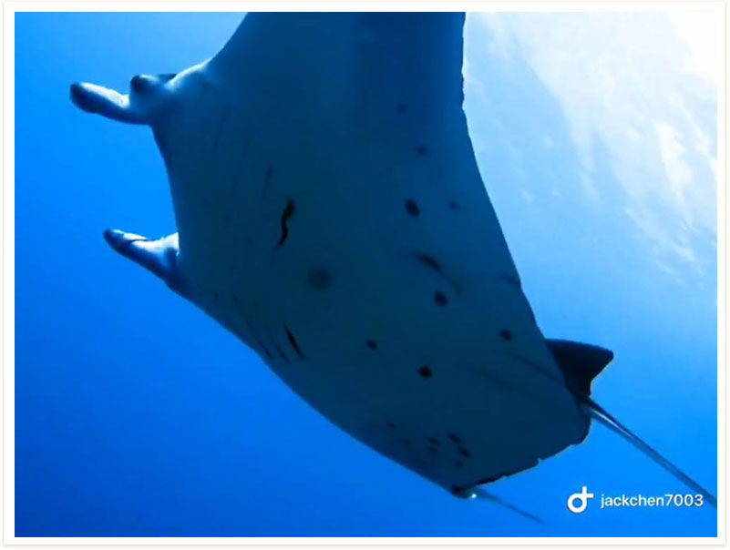
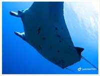

# 105:Manta alfredi,Alfred Manta

found in tubattaha

#### Chinese name:珊瑚礁鬼蝠𛚉、阿氏前口蝠鲼、珊瑚礁鬼蝠鲼，魔鬼鱼、飞鲂仔、鹰鲂

| Thumbnail | Vidwo Link |
| :---: | :---: |
|   | [video](https://drive.google.com/open?id=16yyvmoBZ3CTMaFQyOxybAowV9-BTnoTS) |

