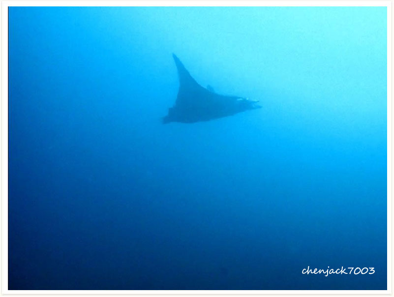

# 106:Mobula eregoodootenkee,Longhorned Pygmy Devil Ray, Pygmy Devilray

found in malapascua

#### Chinese name:魔鬼**蝠鲼**

| Thumbnail | Video Link |
| :---: | :---: |
|   | [video](https://drive.google.com/open?id=14mw-BKr5uT-54H6vCr4ucil_EeJK9_Mb) |

