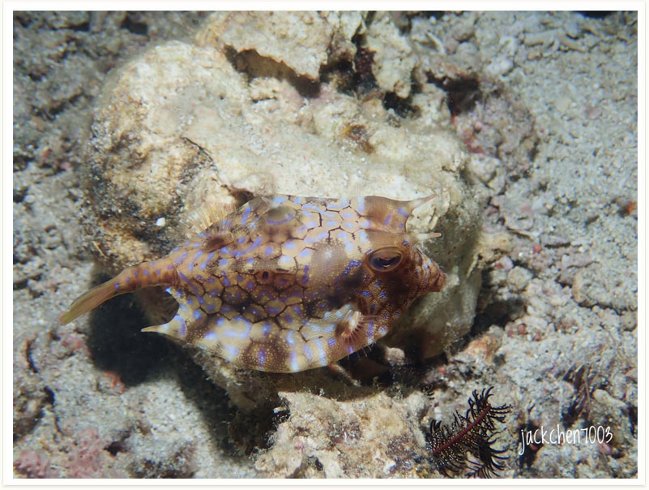

# 113:Lactoria cornuta,Longhorn Cowfish

found in anilao philippines

#### Chinese name:角箱鲀、长牛角、箱河鲀、牛角、牛角狄

| thumbnail | video link |
| :---: | :---: |
|   | [video](https://drive.google.com/open?id=1KwdFPx2uAG0icP45aiLoXrBJGJzo5feu) |

