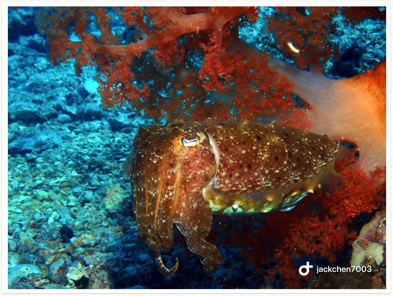
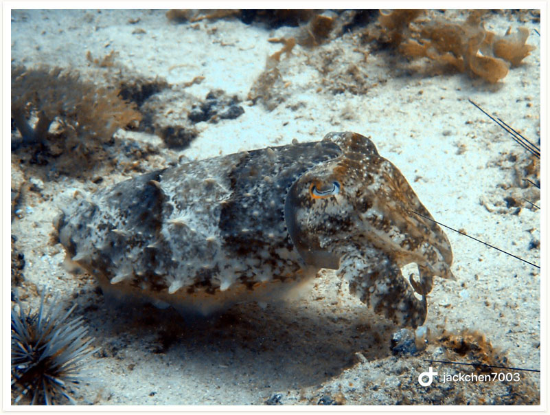

# 116:Sepia latimanus,Broadclub Cuttlefish

found in malapascua philippines

#### Chinese name:白斑乌贼、海归墨鱼、宽腕乌贼

| thumbnail | video link |
| :---: | :---: |
|   | [video](https://drive.google.com/open?id=1ws82zrQb8_2aII7-Ju9qq6FlXoiJWj0e) |

