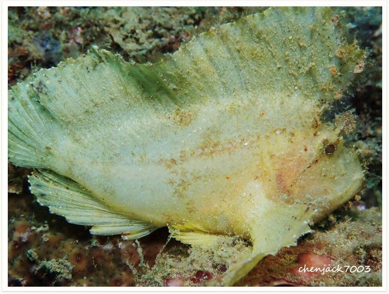

# 117:Taenianotus triacanthus,Leaf Scorpionfish

found in anilao philippines

#### Chinese name:三棘带鲉、三棘高身鲉、石狗公、玫瑰绒鲉、石头鱼

| thumbnail | video link |
| :---: | :---: |
|   | [video](https://drive.google.com/open?id=1QUKl7uyOCyTGq0tyAALIeSDdBSCBpa9s) |

