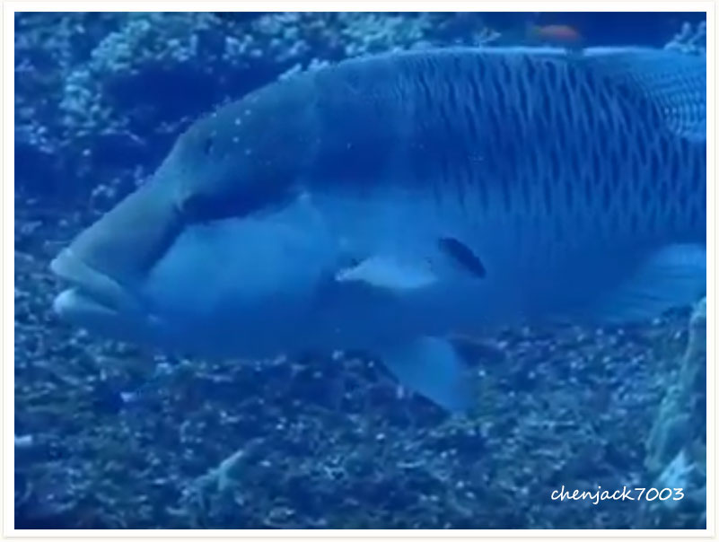
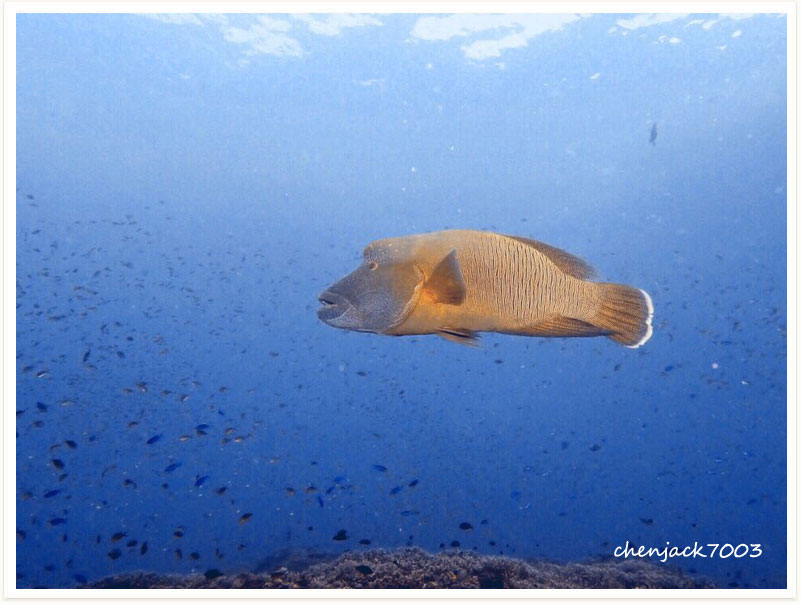

# 119:Cheilinus undulatus,Hump-headed Wrasse,Napoleon Wrasse,Giant Wrasse

#### Chinese name:曲纹唇鱼、苏眉鱼，拿破仑鱼、龙王鲷、海哥龙王、大片仔

| thumbnail | video link | video link |
| :---: | :---: | :---: |
|   | [video1](https://drive.google.com/open?id=1cEto-RBo5JHfq5NrF_DDiFUk2pxoUG2M) | [video2](https://drive.google.com/open?id=1VbgDgs_Cqe6jgbZ126uQfJxGysjHnXjA) |

