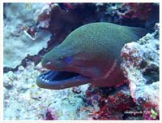

# 123:Gymnothorax javanicus,Giant Moray

#### Chinese name:爪哇裸胸鳝，爪哇裸胸鯙，薯鳗、钱鳗、油锥

| Thumbnail | Video Link |
| :---: | :---: |
|   | [video](https://drive.google.com/open?id=1Goa95TctxBc7lW5dFdaHkGo9fbK-ktVe) |

