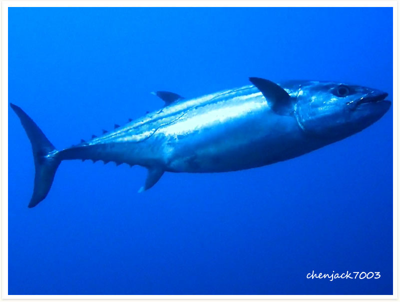

# 127:Gymnosarda unicolor,Dogtooth Tuna

found in apo reef

#### Chinese name:裸狐鲣、裸䲠，长翼

| Thumbnail | Video Link |
| :---: | :---: |
|   | [video](https://drive.google.com/open?id=19GTrkCl9RzlLhDrYbePMGHtTbgGPILkN) |

