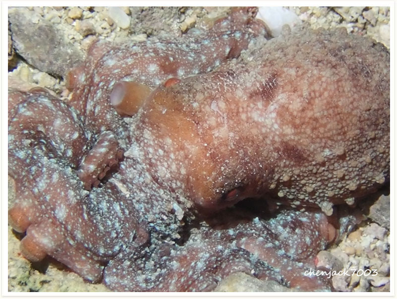

# 128:Callistoctopus macropus,White-spotted Octopus

found in malapascua

#### Chinese name:大西洋白斑章鱼，白斑章鱼，草章鱼、草天窗

| Thumbnail | Video Link |
| :---: | :---: |
|   | [video](https://drive.google.com/open?id=1lC_zbItGa1A3BhGL3PHxFOZrLggpBpzL) |

