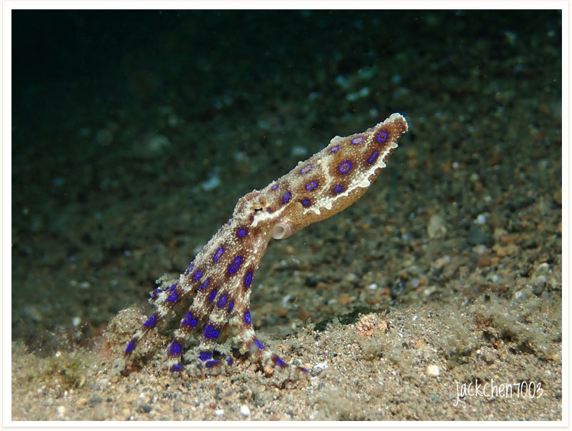
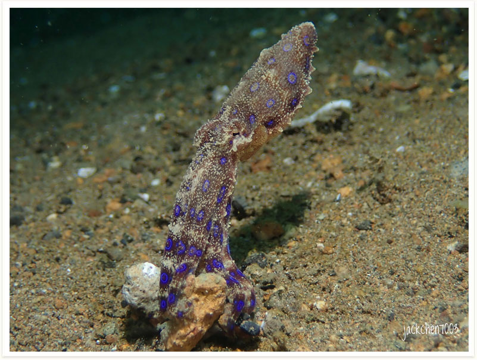

# 136:Hapalochlaena lunulata, Greater blue-ringed Octopus

#### Chinese name:蓝环章鱼

| Thumbnail | VideoLink |
| :---: | :---: |
|   | [video](https://drive.google.com/open?id=1D2sGV-VRMFogM_3UiKWEgOagsi1CTmla) |

