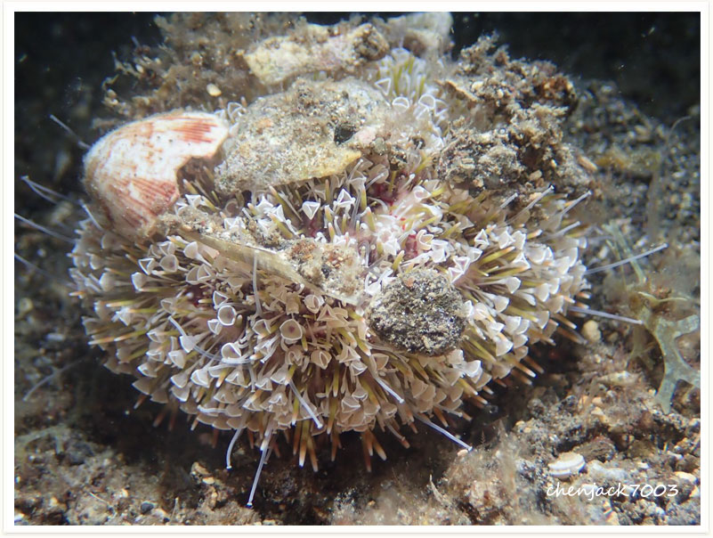

# 139:Toxopneustes pileolus,Flower Urchin

#### Chinese name:喇叭毒棘海胆、花胆

| Thumbnail | VideoLink |
| :---: | :---: |
|   | [video](https://drive.google.com/open?id=1ocSnHNJGwHr3abwfuj69BLmIM13FF6GM) |

