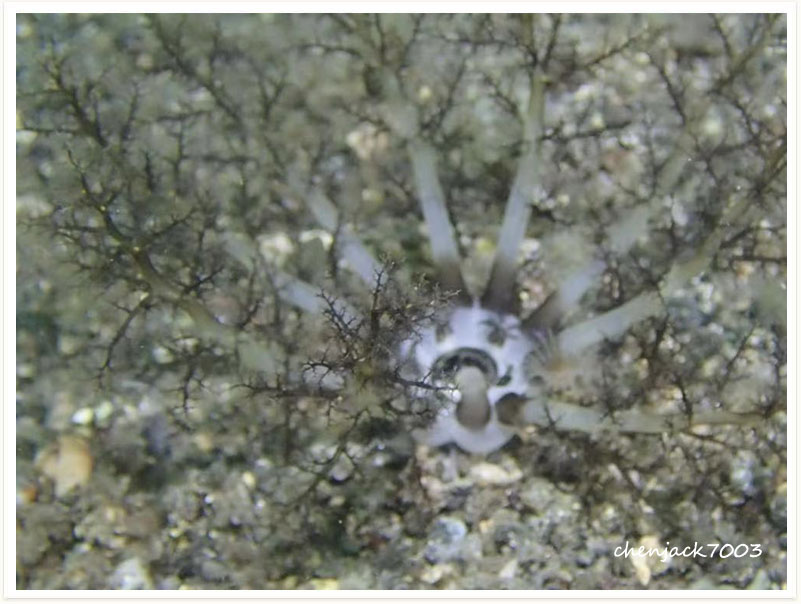

# 140:Neothyonidium magnum,Magnum Sea Cucumber,Burrowing Sea Cucumber

#### Chinese name:洞穴海参

| Thumbnail | VideoLink |
| :---: | :---: |
|   | [video](https://drive.google.com/open?id=1A8uEihX9OwTOPgf_GKVisauyG_NYEfq1) |

