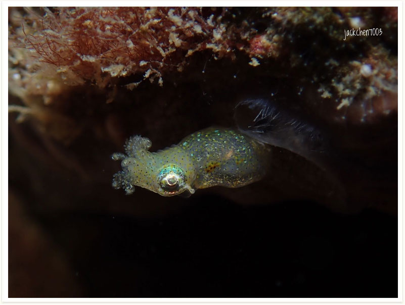

# 141:Idiosepius pygmaeus,Two-tone Pygmy Squid

#### Chinese name:侏儒微鳍乌贼

| Thumbnail | VidwoLink |
| :---: | :---: |
|   | [video](https://drive.google.com/open?id=1GmkxJioW3tWTdWgS3jVkhc8CBR6cwJEX) |

