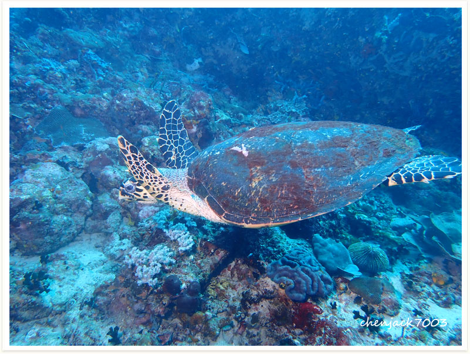

# 144:Eretmochelys imbricata,Hawksbill turtle

#### Chinese name:玳瑁、瑇瑁、蝳蝐、瑇玳、文甲、鹰嘴海龟、十三鲮龟、十三鳞、十三棱龟、明玳瑁、千年龟

| Thumbnail | VideoLink |
| :---: | :---: |
|   | [video](https://drive.google.com/open?id=1U33wCbwUH3Ccgl1O7nhWyj3COZQ-IjTI) |

