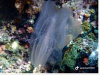

# Fish,Eel,Seastar Part 3

| Thumbnail | Link |
| :---: | :---: |
|   | [101:Eurhamphaea vexilligera,Red-Spot Comb Jelly](101-eurhamphaea-vexilligera-red-spot-comb-jelly.md) |
|   | [102:Hippocampus bargibanti,Pygmy Seahorse](102-hippocampus-bargibanti-pygmy-seahorse.md) |
|   | [103:Hydrophis belcheri,Faint-banded Seasnake](103-hydrophis-belcheri-faint-banded-seasnake.md) |
|   | [104:Lutjanus bohar,Red Snapper,Twospot Red Snapper](104-lutjanus-bohar-red-snapper-twospot-red-snapper.md) |
|   | [105:Manta alfredi,Alfred Manta](105-manta-alfredi-alfred-manta.md) |
|   | [106:Mobula eregoodootenkee,Longhorned Pygmy Devil Ray, Pygmy Devilray](106-mobula-eregoodootenkee-longhorned-pygmy-devil-ray-pygmy-devilray.md) |
|   | [107:Octopus hummelincki,Bumblebee Octopus, Caribbean Two-Spot Octopus](107-octopus-hummelincki-bumblebee-octopus-caribbean-two-spot-octopus.md) |
|   | [108:Ostracion cubicus,Cubed Boxfish,Yellow Box-fish](108-ostracion-cubicus-cubed-boxfish-yellow-box-fish.md) |
|   | [109:Paraploactis kagoshimensis,Phantom Velvetfish](109-paraploactis-kagoshimensis-phantom-velvetfish.md) |

