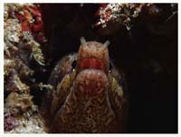
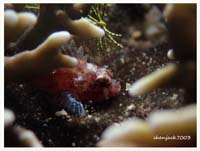
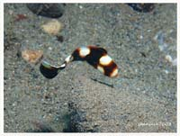

# Fish,Eel,Seastar Part 3

| Thumbnail | Link |
| :---: | :---: |
|   | [101:Eurhamphaea vexilligera,Red-Spot Comb Jelly](101-eurhamphaea-vexilligera-red-spot-comb-jelly.md) |
|   | [102:Hippocampus bargibanti,Pygmy Seahorse](102-hippocampus-bargibanti-pygmy-seahorse.md) |
|   | [103:Hydrophis belcheri,Faint-banded Seasnake](103-hydrophis-belcheri-faint-banded-seasnake.md) |
|   | [104:Lutjanus bohar,Red Snapper,Twospot Red Snapper](104-lutjanus-bohar-red-snapper-twospot-red-snapper.md) |
|   | [105:Manta alfredi,Alfred Manta](105-manta-alfredi-alfred-manta.md) |
|   | [106:Mobula eregoodootenkee,Longhorned Pygmy Devil Ray, Pygmy Devilray](106-mobula-eregoodootenkee-longhorned-pygmy-devil-ray-pygmy-devilray.md) |
|   | [107:Octopus hummelincki,Bumblebee Octopus, Caribbean Two-Spot Octopus](107-octopus-hummelincki-bumblebee-octopus-caribbean-two-spot-octopus.md) |
|   | [108:Ostracion cubicus,Cubed Boxfish,Yellow Box-fish](108-ostracion-cubicus-cubed-boxfish-yellow-box-fish.md) |
|   | [109:Paraploactis kagoshimensis,Phantom Velvetfish](109-paraploactis-kagoshimensis-phantom-velvetfish.md) |
|   | [110:Antennarius commerson,Antennarius commersoni](110-antennarius-commerson-antennarius-commersoni.md) |
|   | [111:Dugong dugon,Dugong](111-dugong-dugon-dugong.md) |
|   | [112:Inimicus didactylus,Bearded ghoul](112-inimicus-didactylus-bearded-ghoul.md) |
|   | [113:Lactoria cornuta,Longhorn Cowfish](113-lactoria-cornuta-longhorn-cowfish.md) |
|   | [114:Pentaceraster alveolatus,Cushion Sea Star](114-pentaceraster-alveolatus-cushion-sea-star.md) |
|   | [115:Scorpaenodes parvipinnis,Lowfin Scorpionfish](115-scorpaenodes-parvipinnis-lowfin-scorpionfish.md) |
|   | [116:Sepia latimanus,Broadclub Cuttlefish](116-sepia-latimanus-broadclub-cuttlefish.md) |
|   | [117:Taenianotus triacanthus,Leaf Scorpionfish](117-taenianotus-triacanthus-leaf-scorpionfish.md) |
|   | [118:Pearsonothuria graeffei,Graeffe's Sea Cucumber, Blackspotted Sea Cucumber](118-pearsonothuria-graeffei-graeffes-sea-cucumber-blackspotted-sea-cucumber.md) |
|   | [119:Cheilinus undulatus,Hump-headed Wrasse,Napoleon Wrasse,Giant Wrasse](119-cheilinus-undulatus-hump-headed-wrasse-napoleon-wrasse-giant-wrasse.md) |
|   | [120:Plectorhinchus albovittatus,Two-striped Sweetlips, Giant Sweetlips](120-plectorhinchus-albovittatus-two-striped-sweetlips-giant-sweetlips.md) |
|   | [121:Rhinopias argoliba,Scorpionfish](121-rhinopias-argoliba-scorpionfish.md) |
|   | [122:Thelenota anax,Amberfish Sea Cucumber](122-thelenota-anax-amberfish-sea-cucumber.md) |
|   | [123:Gymnothorax javanicus,Giant Moray](123-gymnothorax-javanicus-giant-moray.md) |
|   | [124:Rhincodon typus,Whale Shark](124-rhincodon-typus-whale-shark.md) |
|   | [125:Sphyraena putnamae,Sawtooth Barracuda](125-sphyraena-putnamae-sawtooth-barracuda.md) |
|   | [126:Caranx lugubris,Black Jack](126-caranx-lugubris-black-jack.md) |
|   | [127:Gymnosarda unicolor,Dogtooth Tuna](127-gymnosarda-unicolor-dogtooth-tuna.md) |
|   | [128:Callistoctopus macropus,White-spotted Octopus](128-callistoctopus-macropus-white-spotted-octopus.md) |
|   | [129:Centropyge bicolor,Bicolor Angelfish](129-centropyge-bicolor-bicolor-angelfish.md) |
|   | [130:Echinaster callosus,Banded Bubble Star,Warty Sea Star,Lumpy Sea Star](130-echinaster-callosus-banded-bubble-star-warty-sea-star-lumpy-sea-star.md) |
|   | [131:Gymnothorax zonipectis,Barredfin Moray](131-gymnothorax-zonipectis-barredfin-moray.md) |
|   | [132:Echinaster luzonicus,Seastar](132-echinaster-luzonicus-seastar.md) |
|   | [133:Stichopus chloronotus,Greenfish](133-stichopus-chloronotus-greenfish.md) |
|   | [134:Cetoscarus bicolor,Bicolour Parrotfish,Two-colored Parrotfish](134-cetoscarus-bicolor-bicolour-parrotfish-two-colored-parrotfish.md) |
|   | [135:Euapta sp,Seacucumber](135-euapta-sp-seacucumber.md) |
|   | [136:Hapalochlaena lunulata, Greater blue-ringed Octopus](136-hapalochlaena-lunulata-greater-blue-ringed-octopus.md) |
|   | [137:Rhynchostracion nasus,Long-nosed Box-fish, Small-nosed Boxfish](137-rhynchostracion-nasus-long-nosed-box-fish-small-nosed-boxfish.md) |
|   | [138:Sebastapistes strongia,Barchin Scorpionfish](138-sebastapistes-strongia-barchin-scorpionfish.md) |
|   | [139:Toxopneustes pileolus,Flower Urchin](139-toxopneustes-pileolus-flower-urchin.md) |
|   | [140:Neothyonidium magnum,Magnum Sea Cucumber,Burrowing Sea Cucumber](140-neothyonidium-magnum-magnum-sea-cucumber-burrowing-sea-cucumber.md) |
|   | [141:Idiosepius pygmaeus,Two-tone Pygmy Squid](141-idiosepius-pygmaeus-two-tone-pygmy-squid.md) |
|   | [142:Arothron mappa,Map puffer](142-arothron-mappa-map-puffer.md) |
|   | [143:Colochirus robustus,Robust Sea Cucumber,Yellow Sea Cucumber](143-colochirus-robustus-robust-sea-cucumber-yellow-sea-cucumber.md) |
|   | [144:Eretmochelys imbricata,Hawksbill turtle](144-dolabella-auricularia.md) |
|  | [145:Hippocampus histrix,Thorny Seahorse](145-hippocampus-histrix-thorny-seahorse.md) |
|   | [146:Hippocampus kuda,Spotted Seahorse,Estuary Seahorse](146-hippocampus-kuda-spotted-seahorse-estuary-seahorse.md) |
|   | [147:Ophichthus bonaparti,Napoleon Snake Eel,Purple-banded Snake Eel](147-ophichthus-bonaparti-napoleon-snake-eel-purple-banded-snake-eel.md) |
|   | [148:Petroscirtes breviceps,Striped poison-fang blenny mimic](148-petroscirtes-breviceps-striped-poison-fang-blenny-mimic.md) |
|   | [149:Plectorhinchus Orientalis,Oriental Sweetlips](149-plectorhinchus-orientalis-oriental-sweetlips.md) |
|   | [150:Echidna nebulosa,Snowflake Moray](150-echidna-nebulosa-snowflake-moray.md) |

