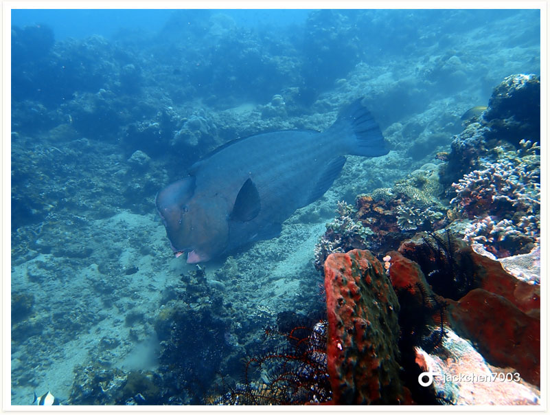

# 156:Bolbometopon muricatum,Bumphead Parrotfish, Double-headed Parrotfish, Green Humphead Parrotfish

#### Chinese name: 隆头鹦哥鱼、驼峰大鹦嘴鱼，鹦哥

| Thumbnail | VideoLink |
| :---: | :---: |
|   | [Video](https://drive.google.com/open?id=1oIu08FibosVbaRjuP7Peg1x66NnkWct-) |

