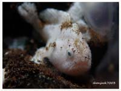
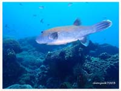
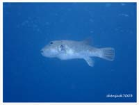
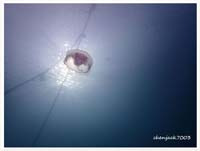
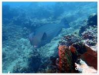
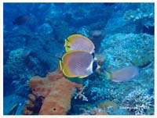
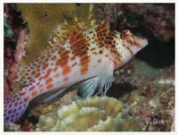
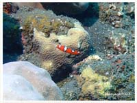
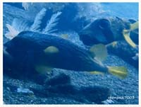

# Fish,Eel,Seastar Part 4

| Thumbnail | Link |
| :---: | :---: |
|   | [151:Thaumoctopus mimicus,Mimic Octopus](151-thaumoctopus-mimicus-mimic-octopus.md) |
|   | [152:Antennarius striatus,Striped Anglerfish](152-antennarius-striatus-striped-anglerfish.md) |
|   | [153:Arothron caeruleopunctatus ,Blue-spotted Puffer](153-arothron-caeruleopunctatus-blue-spotted-puffer.md) |
|   | [154:Arothron stellatus,Star Blaasop, Staring Blow Fish, Star Puffer, Starry Pufferfish, Starry Toadf](154-arothron-stellatus-star-blaasop-staring-blow-fish-star-puffer-starry-pufferfish-starry-toadf.md) |
|   | [155:Aurelia aurita,Moon Jellyfish](155-aurelia-aurita-moon-jellyfish.md) |
|   | [156:Bolbometopon muricatum,Bumphead Parrotfish, Double-headed Parrotfish, Green Humphead Parrotfish](156-bolbometopon-muricatum-bumphead-parrotfish-double-headed-parrotfish-green-humphead-parrotfish.md) |
|   | [157:Chaetodon adiergastos,Bantayan Butterflyfish, Eye-patch Butterflyfish, Panda Butterflyfish](157-chaetodon-adiergastos-bantayan-butterflyfish-eye-patch-butterflyfish-panda-butterflyfish.md) |
|   | [158:Cirrhitichthys falco,Coral Hawkfish , Dwarf Hawkfish, Falco Hawkfish , Falcon Hawkfish](158-cirrhitichthys-falco-coral-hawkfish-dwarf-hawkfish-falco-hawkfish-falcon-hawkfish.md) |
|   | [159:Coris gaimard,African Clown Wrasse, African Coris, Clown Wrasse, Gaimard's Wrasse, Rainbow Wrass](159-coris-gaimard-african-clown-wrasse-african-coris-clown-wrasse-gaimards-wrasse-rainbow-wrass.md) |
|   | [160:Diodon liturosus,Black-blotched Porcupinefish](160-diodon-liturosus-black-blotched-porcupinefish.md) |

