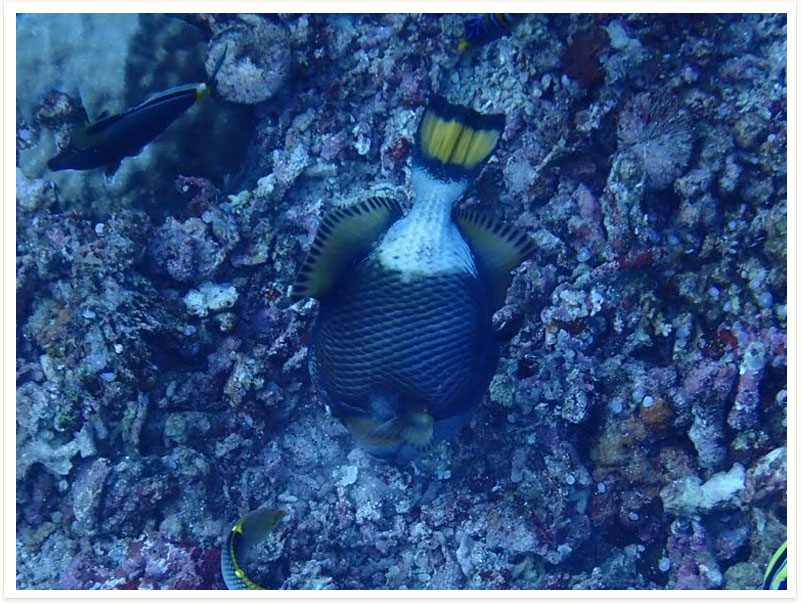
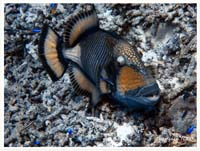

# 14:Balistoides viridescens,Titan Triggerfish

#### Chinese name: **褐拟鳞鲀、** **绿拟鳞鲀**、**胡麻皮剥鲀**、**黄褐炮弹**、**剥皮鱼**、**褐拟板机鲀**

| Thumbnail | Video Link |
| :---: | :---: |
|   | [video](https://drive.google.com/open?id=1Gt0CuuRMqWv7UobDyhu_A0nkwqoGmRke) |

