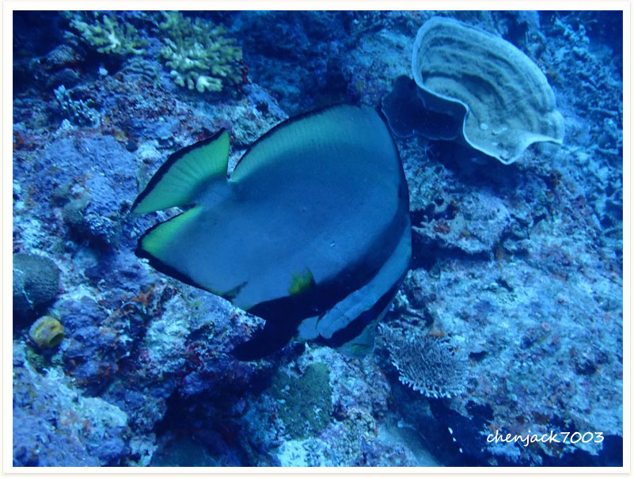
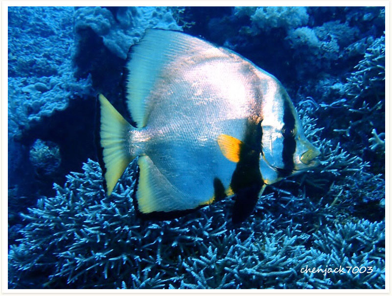
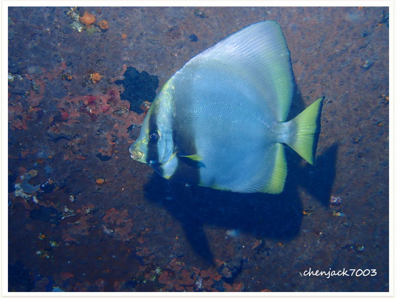
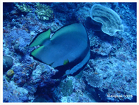

# 7:Platax teira,Longfin Batfish,Tiera Batfish,Spotbelly Batfish

they have spot on there belly.

#### Chinese name:    尖翅燕鱼

| Thumbnail | Vidwo Link |
| :---: | :---: |
|   | [video](https://drive.google.com/open?id=1Az9K-cxog1D5PK_C0yxzcFD0Hud1fkbo) |

