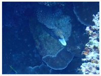

# Fish,Eel,Seastar Part 1

| Thumbnail | Link |
| :---: | :---: |
|   | [1:Threadfin Butterflyfish,Chaetodon auriga](1-threadfin-butterflyfish.md) |
|   | [2:Moorish Idol,Zanclus cornutus](2-moorish-idol.md) |
|   | [3:Black-banded Demoiselle,Amblypomacentrus breviceps](3-black-banded-damselfish.md) |
|   | [4:Masked Spinefoot,Siganus puellus](4-masked-rabbitfish-siganus-puellus-decorated-rabbitfish.md) |
|   | [5:Red And Black Anemonefish,Fire Clownfish,Amphiprion melanopus](5-red-and-black-anemonefish-amphiprion-melanopus.md) |
|   | [6:Clown Anemonefish, Western Clown Anemonefish,Amphiprion ocellaris](6-false-clown-anemonefish-ocellaris-clownfish-amphiprion-ocellaris.md) |
|   | [7:Orbicular Batfish,Platax orbicularis](7-circular-spadefish-platax-orbicularis.md) |
|   | [8:Yellowbanded Sweetlips,Plectorhinchus lineatus](8-diagonal-banded-sweetlips-plectorhinchus-lineatus.md) |
|   | [9:Okinawa goby,Gobiodon okinawae](9-lubricogobius-exiguus-yellow-pygmy-goby.md) |
|   | [10:Large Whip Goby,Bryaninops amplus](10-bryaninops-loki-loki-whip-goby.md) |
|   | [11:Carpet Sole,Liachirus melanospilos](11-carpet-sole.md) |
|   | [12:Warty Frogfish,Antennarius maculatus](12-warty-frogfish-antennarius-maculatus.md) |
|   | [13:Painted Frogfish,Antennarius Pictus](13-painted-frogfish-antennarius-pictus.md) |
|   | [14:Titan Triggerfish,Balistoides viridescens](14-titan-triggerfish.md) |
|   | [15:Birdbeak Burrfish,Cyclichthys orbicularis](15-orbicular-burrfish.md) |
|   | [16:Spotfin Burrfish,Chilomycterus reticulatus](16-spotfin-burrfish.md) |
|   | [17:Diodon holocanthus,Long-spine Porcupinefish](17-masked-porcuplinefish.md) |
|   | [18:Pacific Trumpetfish,Chinese Trumpetfish,Aulostomus chinensis](18-pacific-trumpetfish.md) |
|   | [19:Harlequin Ghost Pipefish, Ornate Ghost Pipefish,Solenostomus paradoxus](19-ornate-ghost-pipefish-solenostomus-paradoxus.md) |
|   | [20:Yellowbanded Pipefish,Dunckerocampus pessuliferus](20-ringed-pipefish-doryrhamphus-dactyliophorus-banded-pipefish.md) |
|   | [21:Messmate Pipefish,Corythoichthys haematopterus](21-orange-spotted-pipefish-corythoichthys-ocellatus.md) |
|   | [22:Yellow-edged Moray,Gymnothorax flavimarginatus](22-yellowmargin-moray-eel.md) |
|   | [23:Greyface Moray Eel,White-eyed Moray, Gymnothorax thyrsoideus](23-white-eyed-moray-eel.md) |
|   | [24:Turkey Moray,White-mouth Moray,Gymnothorax meleagris](24-whitemouth-moray-eel-gymnothorax-meleagris-guinea-moray-eel-spotted-moray.md) |
|   | [25:Ribbon Moray Eel,Rhinomuraena quaesita](25-ribbon-moray-eel-rhinomuraena-quaesita.md) |
|   | [26:Dwarf Moray,Gymnothorax melatremus](26-golden-moral-eel.md) |
|   | [27:Black-finned Snake Eel,Ophichthus altipennis](27-black-finned-snake-eel.md) |
|   | [28:Bluespotted Stingray,Neotrygon kuhlii](28-blue-spotted-stingray.md) |
|   | [29:Whitetip Reef Shark,Triaenodon obesus](29-whitetip-reef-shark-triaenodon-obesus.md) |
|   | [30:Electric Clam,Ctenoides ales](30-electronic-shell.md) |
|   | [31:Granulated Sea Star,Choriaster granulatus](31-granulated-sea-star.md) |
|   | [32:Ornate Slippery Goby, Lubricogobius ornatus](32-blue-eye-goby.md) |
|   | [33:Necklace Starfish,Fromia monilis](33-peppermint-starfish.md) |
|   | [34:LinckiaSeaStar,Linckialaevigata](34-blue-linckia.md) |
|   | [35: Crown-of-thorns Sea Star,Acanthaster planci](35-crown-of-thorns-starfish.md) |
|   | [36:Giant Trevally,Caranx ignobilis](36-caranx-ignobilis-giant-trevally.md) |
|   | [37:Bearded scorpionfish,Scorpaenopsis barbata](37-stone-fish.md) |
|   | [38:Hummingbird Bobtail Squid,Euprymna berryi](38-berrys-bobtail-squid-euprymna-berryi-humming-bird-bobtail-squid.md) |
|   | [39:Crocodile Fish,Cymbacephalus beauforti](39-crocodile-fish-cymbacephalus-beauforti-de-beauforts-flathead.md) |
|   | [40:File fish,Brachaluteres jacksonianus](21-unknow.md) |
|   | [41:Dark Red-Spined Brittle Star](41-dark-red-spined-brittle-star.md) |
|   | [42:Japanese Surgeonfish,Acanthurus japonicus](42-japanese-surgeonfish-acanthurus-japonicus.md) |
|   | [43：Three-spot Dascyllus,Dascyllus trimaculatus](43-three-spot-dascyllus.md) |
|   | [44:Striped Large-eye Bream,Gnathodentex aureolineatus](44-striped-large-eye-bream-gnathodentex-aureolineatus.md) |
|   | [45:Black Spoteed Puffer,Arothron nigropunctatus](45-black-spoteed-puffer-arothron-nigropunctatus.md) |
|   | [46:Emperor Angelfish,Pomacanthus imperator](46-emperor-angelfish-pomacanthus-imperator.md) |
|   | [47:Pyramid Butterflyfish,Hemitaurichthys polylepis](47-pyramid-butterflyfish-hemitaurichthys-polylepis.md) |
|   | [48:Ornate Butterflyfish,Chaetodon ornatissimus](48-ornate-butterflyfish-chaetodon-ornatissimus.md) |
|   | [49:Longnose Butterflyfish,Forcipiger flavissimus](49-longnose-butterflyfish-forcipiger-flavissimus.md) |
|   | [50:Bennett's Butterflyfish,Chaetodon bennetti](50-bennetts-butterflyfish-chaetodon-bennetti.md) |

