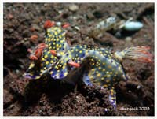

# Nudibranch,Flatworm3

| Thumbnail | Link |
| :---: | :---: |
|    | [111:Coryphellina lotos](111-coryphellina-lotos.md) |
|   | [112:Dolabella auricularia,Blunt-end Sea Hare, Eared Sea Hare, Wedge Sea Hare](112-dolabella-auricularia-blunt-end-sea-hare-eared-sea-hare-wedge-sea-hare.md) |
|   | [113:Costasiella-sp, Shaun the Sheep Nudibranch](113-costasiella-sp-shaun-the-sheep-nudibranch.md) |
|   | [114:Costasiella usagi,Shaun the Sheep Nudibranch](114-costasiella-usagi-shaun-the-sheep-nudibranch.md) |
|   | [115:Dendrodoris carbunculosa ,Nudibranch](115-dendrodoris-carbunculosa-nudibranch.md) |
|   | [116:Eubranchus-sp,Nudibranch](116-eubranchus-sp-nudibranch.md) |
|   | [117:Eubranchus-sp2,Nudibranch](117-eubranchus-sp2-nudibranch.md) |
|   | [118:Hypselodoris infucata,Mottled Dorid, Painted Hypselodoris](118-hypselodoris-infucata-mottled-dorid-painted-hypselodoris.md) |
|   | [119:Hypselodoris roo,Nudibranch](119-hypselodoris-roo-nudibranch.md) |
|   | [120:Hypselodoris zephyra,Nudibranch](120-hypselodoris-zephyra-nudibranch.md) |
|   | [121:Lomanotus-sp,Nudibranch](121-lomanotus-sp-nudibranch.md) |
|   | [122:Melibe viridis,Green Melibe](122-melibe-viridis-green-melibe.md) |
|   | [123:Siphopteron tigrinum,Batwing Slug](123-siphopteron-tigrinum-batwing-slug.md) |
|   | [124:Haminoea sp,Bubble Snail](124-tambja-morosa-gloomy-nudibranch.md) |
|   | [125:Thecacera-sp,Nudibranch](125-thecacera-sp-nudibranch.md) |
|   | [126:Thuridilla carlsoni,Sapsucking Slug](126-thuridilla-carlsoni-sapsucking-slug.md) |
|   | [127:Unidentia sandramillenae ,Nudibranch](127-unidentia-sandramillenae-nudibranch.md) |

