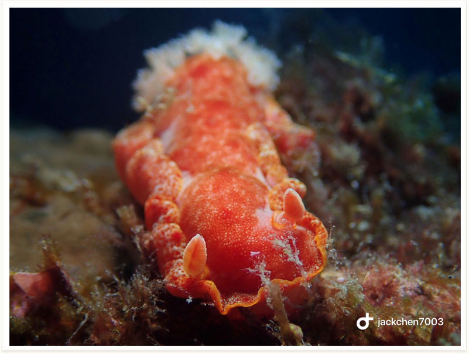

# 83:Hexabranchus sanguineus,Spanish Dancer

found in malapascua philippines

#### Chinese name:血红六鳃海麒麟、西班牙舞娘

| thumbnail | video link |
| :---: | :---: |
|   | [video](https://drive.google.com/open?id=12bEgLNzPnJk_zTs6bueAgTsFsx5OMiJf) |

