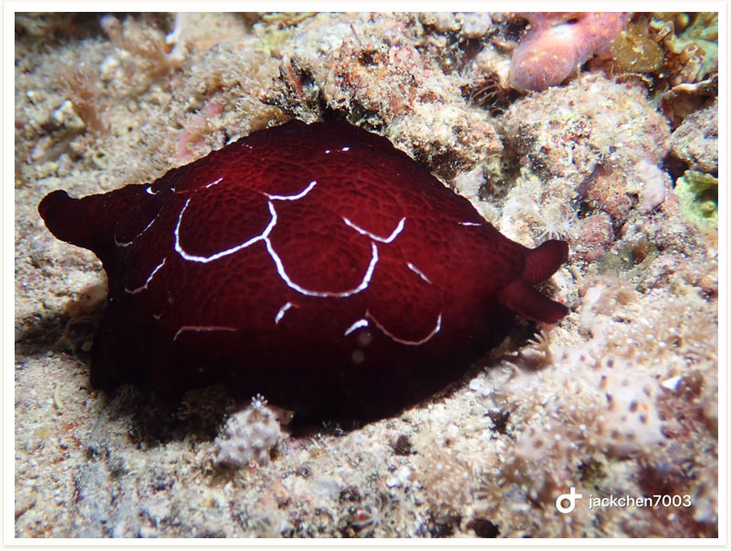

# 85:Pleurobranchus forskalii,Sidegill Slug

found in malapascua philippines

#### Chinese name:福斯卡侧鰓海蛞蝓

| thumbnail | video link |
| :---: | :---: |
|   | [video](https://drive.google.com/open?id=16HTnb0DWmz2pPZCu-8JHs0BmXsttXp3e) |

