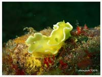
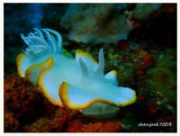
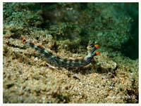
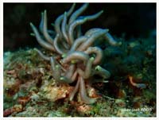

# Nudibranch,Platworm2

| Thumbnail | Link |
| :---: | :---: |
|   | [51:Chelidonura hirundinina,Swallotail Headshield Slug, Leech Aglaja](51-chelidonura-hirundinina-swallotail-headshield-slug-leech-aglaja.md) |
|   | [52:Diversidoris crocea](52-diversidoris-crocea.md) |
|   | [53:Ardeadoris egretta,Heron Ardeadoris](53-ardeadoris-egretta-heron-ardeadoris.md) |
|   | [54:Thuridilla gracilis,Sapsucking Slug](54-thuridilla-gracilis-sapsucking-slug.md) |
|   | [55:Phyllodesmium briareum,Yellow-Tipped Phyllodesmium](55-phyllodesmium-briareum-yellow-tipped-phyllodesmium.md) |

