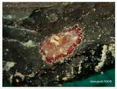
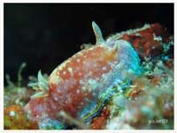

# Nudibranch,Flatworm2

| Thumbnail | Link |
| :---: | :---: |
|   | [51:Chelidonura hirundinina,Swallotail Headshield Slug, Leech Aglaja](51-chelidonura-hirundinina-swallotail-headshield-slug-leech-aglaja.md) |
|   | [52:Diversidoris crocea](52-diversidoris-crocea.md) |
|   | [53:Ardeadoris egretta,Heron Ardeadoris](53-ardeadoris-egretta-heron-ardeadoris.md) |
|   | [54:Thuridilla gracilis,Sapsucking Slug](54-thuridilla-gracilis-sapsucking-slug.md) |
|   | [55:Phyllodesmium briareum,Yellow-Tipped Phyllodesmium](55-phyllodesmium-briareum-yellow-tipped-phyllodesmium.md) |
|   | [56:Aegires villosus,Hairy Norse God](56-aegires-villosus-hairy-norse-god.md) |
|   | [57:Hypselodoris krakatoa,Hypselodoris Krakatoa](57-hypselodoris-krakatoa-hypselodoris-krakatoa.md) |
|   | [58:Miamira alleni](58-miamira-alleni.md) |
|   | [59:Nembrotha kubaryana,Nembrotha Kubaryana](59-nembrotha-kubaryana-nembrotha-kubaryana.md) |
|   | [60:Nembrotha milleri,Miller's Nembrotha](60-nembrotha-milleri-millers-nembrotha.md) |
|   | [61:Paraplanocera marginata](61-paraplanocera-marginata.md) |
|   | [62:Philinopsis pilsbryi,Pilsbry's Headshield Slug](62-philinopsis-pilsbryi-pilsbrys-headshield-slug.md) |
|   | [63:Phyllidiopsis annae,Anne's Phyllidiopsis](63-phyllidiopsis-annae-annes-phyllidiopsis.md) |
|   | [64:Phyllodesmium crypticum,Cryptic Phyllodesmium](64-phyllodesmium-crypticum-cryptic-phyllodesmium.md) |
|   | [65:Phyllodesmium opalescens](65-phyllodesmium-opalescens.md) |
|   | [66:Pteraeolidia semperi](66-pteraeolidia-semperi.md) |
|   | [67:Reticulidia halgerda,Halgerda Reticulidia](67-reticulidia-halgerda-halgerda-reticulidia.md) |
|   | [68:Sclerodoris tuberculata](68-sclerodoris-tuberculata.md) |
|   | [69:Tritonia nilsodhneri,Tritonia Nilsodhneri](69-tritonia-nilsodhneri-tritonia-nilsodhneri.md) |
|   | [70:Aplysia oculifera,Spotted Sea Hare](70-aplysia-oculifera-spotted-sea-hare.md) |
|   | [71:Armina semperi](71-armina-semperi.md) |
|   | [72:Doto racemosa](72-doto-racemosa.md) |
|   | [73:Lobiger viridis,Green Sapsucking Slug](73-lobiger-viridis-green-sapsucking-slug.md) |
|   | [74:Phyllodesmium lizardense,Lizard Island Phyllodesmium](74-phyllodesmium-lizardense-lizard-island-phyllodesmium.md) |
|   | [75:Tambja morosa,Gloomy Nudibranch](75-tambja-morosa-gloomy-nudibranch.md) |
|   | [76:Thorunna australis](76-thorunna-australis.md) |
|   | [77:Carminodoris nodulosa](77-carminodoris-nodulosa.md) |
|   | [78:Goniobranchus reticulatus](78-goniobranchus-reticulatus.md) |
|   | [79:Hypselodoris tryoni,Tryon's Risbecia](79-hypselodoris-tryoni-tryons-risbecia.md) |
|   | [80:Bornella anguilla,Snakey Bornella, Eel Bornella](80-bornella-anguilla-snakey-bornella-eel-bornella.md) |
|   | [81:Goniobranchus coi,Co's Chromodoris](81-goniobranchus-coi-cos-chromodoris.md) |
|   | [82:Halgerda batangas,Batangas Halgerda](82-halgerda-batangas-batangas-halgerda.md) |
|   | [83:Hexabranchus sanguineus,Spanish Dancer](83-hexabranchus-sanguineus-spanish-dancer.md) |
|   | [84:Miamira miamirana](84-miamira-miamirana.md) |
|   | [85:Pleurobranchus forskalii,Sidegill Slug](85-pleurobranchus-forskalii-sidegill-slug.md) |
|   | [86:Pseudoceros lindae,Linda's Flatworm, Polyclad Flatworm](86-pseudoceros-lindae-lindas-flatworm-polyclad-flatworm.md) |
|   | [87:Notobryon wardi,Iridescent Nudibranch, Ward's Nudibranch](87-notobryon-wardi-iridescent-nudibranch-wards-nudibranch.md) |
|   | [88:Coryphellina exoptata,Desirable Flabellina](88-coryphellina-exoptata-desirable-flabellina.md) |
|   | [89:Aegires serenae,Gray Norse God](89-aegires-serenae-gray-norse-god.md) |
|   | [90:Chelidonura amoena,Lovely Headshield Slug](90-chelidonura-amoena-lovely-headshield-slug.md) |
|   | [91:Colpodaspis thompsoni,Fried Egg Sea Slug](91-colpodaspis-thompsoni-fried-egg-sea-slug.md) |
|   | [92:Goniobranchus albopunctatus,White-spotted Nudibranch](92-goniobranchus-albopunctatus-white-spotted-nudibranch.md) |
|   | [93:Hypselodoris apolegma,Giant Hypselodoris](93-hypselodoris-apolegma-giant-hypselodoris.md) |
|   | [94:Hypselodoris purpureomaculosa](94-hypselodoris-purpureomaculosa.md) |
|   | [95:Nembrotha cristata,Crested Nembrotha](95-nembrotha-cristata-crested-nembrotha.md) |
|   | [96:Paradoris liturata,Bumpy Paradoris](96-paradoris-liturata-bumpy-paradoris.md) |
|   | [97:Costasiella kuroshimae,Shaun the Sheep Nudibranch](97-costasiella-kuroshimae-shaun-the-sheep-nudibranch.md) |
|   | [98:Pseudoceros liparus,Racing-Stripes-Flatworm](98-pseudoceros-liparus-racing-stripes-flatworm.md) |
|   | [99:Pseudoceros scintillatus,Brilliant Flatworm](99-pseudoceros-scintillatus-brilliant-flatworm.md) |
|   | [100:Oxynoe viridis,Supsucking Slug, Sacoglossa](100-oxynoe-viridis-supsucking-slug-sacoglossa.md) |

