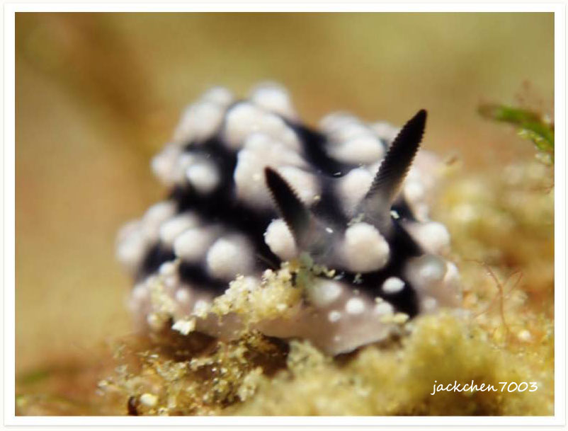
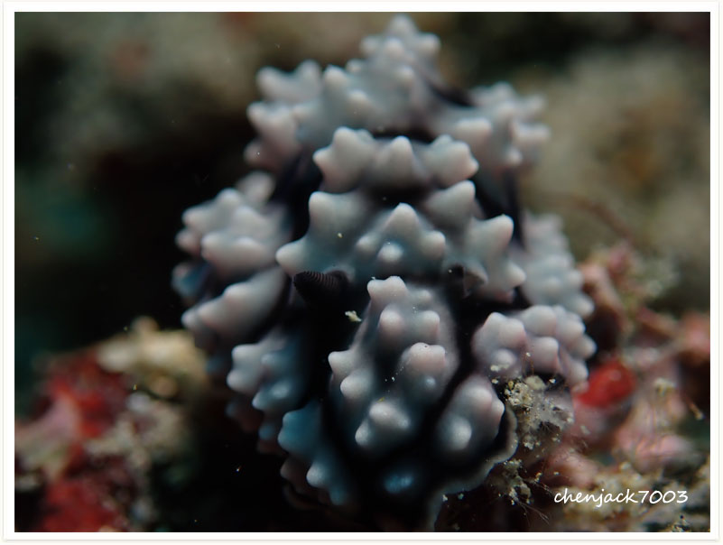

# 11: Nudibranch,Phyllidiella cooraburrama

#### Chinese name:[古怪叶海蛞蝓](https://www.baidu.com/link?url=V3XjRzifgSVzhRmUVntzCerD99FLk7GIteB-_SWf6O68pbGaKIrW2W7P8sifYEGSYG6YsPPGX2dSv0ltDIUn7ixgJd2XxtJ9PcY2YkFd1cubwZKSEQgJa8-9x77jcKpZ&wd=&eqid=a3eb64f40008509c000000065c66c336)

