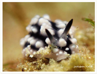
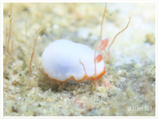
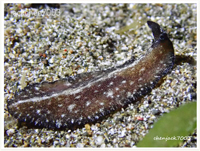

# Nudibranch,Flatworm1

| Thumbnail | Link |
| :---: | :---: |
|   | [1:Chamberlain's Nembrotha,Nembrotha chamberlaini](1-chamberlains-nembrotha.md) |
|   | [2:Magnificent Chromodoris,Chromodoris magnifica](49-chromodoris-magnifica.md) |
|   | [3:Psychedelic Batwing Slug,Sagaminopteron psychedelicum](3-psychedelic-batwing-slug.md) |
|   | [4:Ornate Sapsucking Slug,Ornate Leaf Slug,Elysia ornata](4-ornate-elysia-ornate-sapsucking-slug.md) |
|   | [5:Lined Nembrotha,Nembrotha lineolata](5-nembrotha-lineolata.md) |
|   | [6:Funeral Jorunna,Jorunna funebris](6-jorunna-funebris-funeral-jorunna.md) |
|   | [7:Kunie's Chromodoris,Goniobranchus kuniei](7-kunies-chromodoris-goniobranchus-kuniei.md) |
|   | [8:Bus Stop Chromodoris,Goniobranchus hintuanensis](8-bus-stop-chromodoris-chromodoris-hintuanensis.md) |
|   | [9:Cadlinella ornatissima,Cadlinella ornatissima](9-ornamental-cadlinella.md) |
|   | [10:Ocellated Phyllidia,Phyllidia ocellata](10-ocellated-phyllidia.md) |
|   | [11: Nudibranch,Phyllidiella cooraburrama](11-pimpled-phyllidiella.md) |
|   | [12: Anna's Chromodoris,Chromodoris annae](12-annas-chromodoris-chromodoris-annae.md) |
|   | [13:Coleman's Phyllodesmium,Phyllodesmium colemani](13-phyllodesmium-colemani-not-sure-if-its-called-this-name.md) |
|   | [14: Girdled Glossodoris,Glossodoris cincta](14-girdled-glossodoris-glossodoris-pullata.md) |
|   | [15: Willan's Chromodoris,Chromodoris willani](15-willans-chromodoris.md) |
|   | [16:Pimpled Phyllidiella,Phyllidiella pustulosa](16-phyllidiella-pustulosa.md) |
|   | [17: Nudibranch,Hypselodoris bullockii](17-bullocks-hypselodoris.md) |
|   | [18:Painted Thecacera,Thecacera picta](47-painted-thecacera.md) |
|   | [19:Eggs of Spainish Dancer](19-eggs-of-spainish-dancer.md) |
|   | [20:Nudibranch,Phyllodesmium opalescens](20-phyllodesmium-opalescens.md) |
|   | [21: Indian Caloria,Caloria indica](21-indian-caloria-phidiana-indica.md) |
|   | [22:Creamy Chromodoris,Goniobranchus fidelis](22-chromodoris-fidelis.md) |
|   | [23: Blue Dragon Nudibranch,Pteraeolidia ianthina](23-blue-dragon-nudibranch-pteraeolidia-ianthina.md) |
|   | [24: Redline Flabellina,Flabellina rubrolineata](24-redline-flabellina-flabellina-rubrolineata.md) |
|   | [25: Nudibranch,Verconia alboannulata](25-white-ring-noumea.md) |
|   | [26: Dark Margin Glossodoris,Doriprismatica atromarginata](26-dark-margin-glossodoris-glossodoris-atromarginata.md) |
|   | [27: Yellow Flatworm,Pseudoceros laingensis](27-laing-island-flatworm.md) |
|   | [28: Blue Velvet Headshield Slug,Chelidonura varians](28-sapphire-flatworm.md) |
|   | [29:Yellowspot Flatworm,Thysanozoon flavotuberculatum](29-thysanozoon-sp.-1.md) |
|   | [30: Loch's Chromodoris,Chromodoris lochi](30-lochs-chromodoris.md) |
|   | [31: Elisabeth's Chromodoris,Chromodoris elisabethina](31-elisabeths-chromodoris.md) |
|   | [32: Diana's Chromodoris,Chromodoris dianae](32-dianas-chromodoris.md) |
|   | [33:Purple-tipped Janolus,Janolus savinkini](48-janolus-savinkini.md) |
|   | [34: Geometric Chromodoris,Goniobranchus geometricus](34-geometric-chromodoris.md) |
|   | [35: Nudibranch,Goniobranchus rubrocornutus](35-precious-chromodoris.md) |
|   | [36: Bumpy Mexichromis,Mexichromis multituberculata](36-bumpy-mexichromis-purple-tipped-multi-pustuled-slug-mexichromis-multituber.md) |
|   | [37: Mushroom Coral Reticulidia,Reticulidia fungia](37-mushroom-coral-reticulidia.md) |
|   | [38: Double-ringed Flabellina,Samla bilas](38-bicolor-flabellina.md) |
|   | [39: Sky Blue Phyllidia,Phyllidia coelestis](39-sea-blue-phyllidia.md) |
|   | [40:Headshield Slug,Spinophallus falciphallus](40-philinopsis-falciphallus-gosliner.md) |
|   | [41:CKangaroo Nudibranch, Purple Edged Ceratosoma Nudibranch,Ceratosoma tenue](8-unknow.md) |
|   | [42:Nudibranch,Hypselodoris purpureomaculosa](3-unknow.md) |
|   | [43:Cratena lineata](4-unknow.md) |
|   | [44:Nudibranch,Phestilla melanobrachia](7-unknow.md) |
|   | [45:Nudibranch,Bulbaeolidia alba](9-unknow.md) |
|   | [46:White-spotted Thuridilla,Thuridilla albopustulosa](12-unknow.md) |
|   | [47:Baba's Phyllidia,Phyllidia babai](2-unknow.md) |
|   | [48:Flatworm,Pseudoceros kylie](5-unknow.md) |
|   | [49:Sap-sucking Slug,Plakobranchus papua](49-sap-sucking-slug-plakobranchus-papua.md) |
|   | [50:Ascidiophilla alba,flatworm](50-ascidiophilla-alba-flatworm.md) |

