# Others

| thumbnail | name |
| :---: | :---: |
| 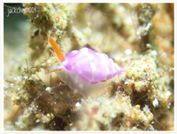  | [1:Hemilienardia goubini,sea snail](1-hemilienardia-goubini-sea-snail.md) |
| 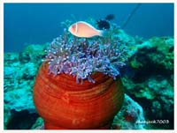  | [2:Heteractis magnifica,Colored long tentacle Anemone](2-heteractis-magnifica-colored-long-tentacle-anemone.md) |
| 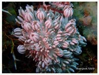  | [3:Ovabunda macrospiculata,Soft coral](3-ovabunda-macrospiculata-soft-coral.md) |
| 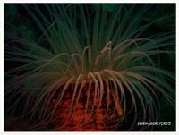  | [4:Pachycerianthus longistriatus,Striped tube anemone, Striated tube](4-pachycerianthus-longistriatus-striped-tube-anemone-striated-tube.md) |
| 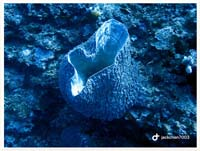  | [5:barrel sponge,Xestospongia testudinaria](5-barrel-sponge-xestospongia-testudinaria.md) |
| 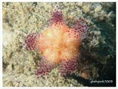  | [6:Asthenosoma varium,Fire Urchin](6-asthenosoma-varium-fire-urchin.md) |
| 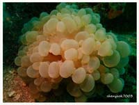  | [7:Plerogyra sinuosa,Bubble Coral](7-plerogyra-sinuosa-bubble-coral.md) |
| 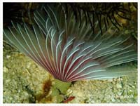  | [8:Anamobaea sp,Ghost Feather Duster](8-anamobaea-sp-ghost-feather-duster.md) |
| 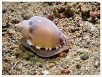  | [9:Casmaria ponderosa,Heavy Bonnet](9-casmaria-ponderosa-heavy-bonnet.md) |
| 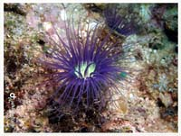  | [10:Cerianthus filiformis,Tube Anemone, Large Tube Anemone](10-cerianthus-filiformis-tube-anemone-large-tube-anemone.md) |
| 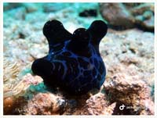  | [11:Coriocella nigra,Network Lamellaria,Lack Velutinid](11-coriocella-nigra-network-lamellaria-lack-velutinid.md) |
| 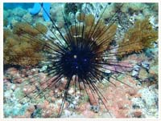  | [12:Diadema paucispinum](12-diadema-paucispinum.md) |
| 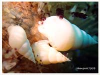  | [13:Echineulima asthenosomae,Fire Urchin Snail](13-echineulima-asthenosomae-fire-urchin-snail.md) |
| 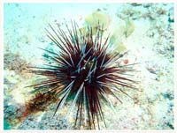  | [14:Echinothrix calamaris,Banded Urchin](14-echinothrix-calamaris-banded-urchin.md) |
| 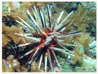  | [15:Eucidaris thouarsii,Slate Pencil Urchin](15-eucidaris-thouarsii-slate-pencil-urchin.md) |
| 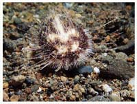  | [16:Maretia planulata,Irregular Sea Urchin](16-maretia-planulata-irregular-sea-urchin.md) |
| 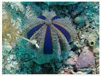  | [17:Mespilia globulus,Tuxedo Urchin](17-mespilia-globulus-tuxedo-urchin.md) |
| 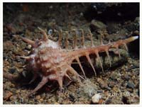  | [18:Murex ternispina,Triple-spined Murex, Black-spined Murex](18-murex-ternispina-triple-spined-murex-black-spined-murex.md) |
| 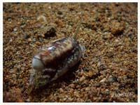  | [19:Oliva oliva](19-oliva-oliva.md) |
| 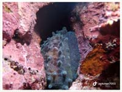  | [20:Talparia talpa,Chocolate Banded Cowry](20-talparia-talpa-chocolate-banded-cowry.md) |
| 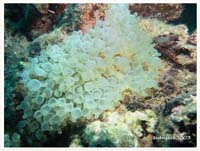  | [21:Entacmaea quadricolor,Bulb-entacle Sea Anemone,Bubble-tip Sea Anemone](21-entacmaea-quadricolor-bulb-entacle-sea-anemone-bubble-tip-sea-anemone.md) |
| 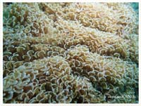  | [22:Fimbriaphyllia ancora,Anchor Coral Hammer Coral](22-fimbriaphyllia-ancora-anchor-coral-hammer-coral.md) |
| 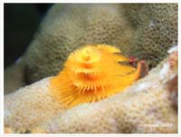  | [23:Spirobranchus giganteus,Christmas Tree Worm, Horned Feather Worm](23-spirobranchus-giganteus-christmas-tree-worm-horned-feather-worm.md) |
| 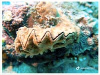  | [24:Hyotissa hyotis,True Oysters](24-hyotissa-hyotis-true-oysters.md) |
| 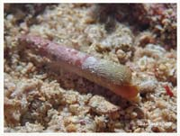  | [25:Terebra sp](25-terebra-sp.md) |
| 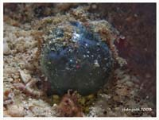  | [26:Ventricaria ventricosa](26-ventricaria-ventricosa.md) |
| 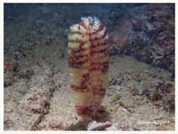  | [27:Virgularia Sp,Sea Pen](27-virgularia-sp-sea-pen.md) |
| 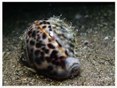  | [28:Cypraea pantherina,Panther Cowry](28-cypraea-pantherina-panther-cowry.md) |
|   | [29:Phalium bandatum,Banded Bonnet](29-phalium-bandatum-banded-bonnet.md) |
| 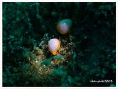  | [30:Cystiscus minutissimus](30-cystiscus-minutissimus.md) |
| 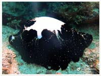  | [31:Ovula ovum,Common Egg Cowrie](31-ovula-ovum-common-egg-cowrie.md) |
| 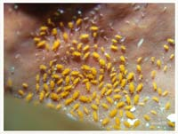  | [32:Santia sp,Sponge Isopod](32-santia-sp-sponge-isopod.md) |
| 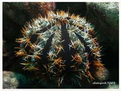  | [33:Tripneustes gratilla,Pincushion Hairy Urchin,Cake Sea Urchin](33-tripneustes-gratilla-pincushion-hairy-urchin-cake-sea-urchin.md) |
| 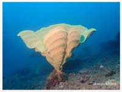  | [34:Ianthella basta,Elephant Ear Sponge, Paper Sponge](34-ianthella-basta-elephant-ear-sponge-paper-sponge.md) |
| 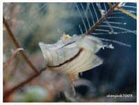  | [35:Pteria crocea](35-pteria-crocea.md) |
| 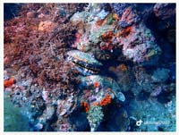  | [36:Spondylus varius,Giant variable Thorny Oyster](36-spondylus-varius-giant-variable-thorny-oyster.md) |

