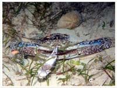

# 55:Portunus pelagicus,Flower Crab, Blue Swimmer Crab

#### Chinese name:远海梭子蟹、市仔、花脚市仔、花蟹

| Thumbnail | Video Link |
| :---: | :---: |
|   | [video](https://drive.google.com/open?id=1GSp427WIKgJxHEZpKqq1QhpRt_MqkivK) |

