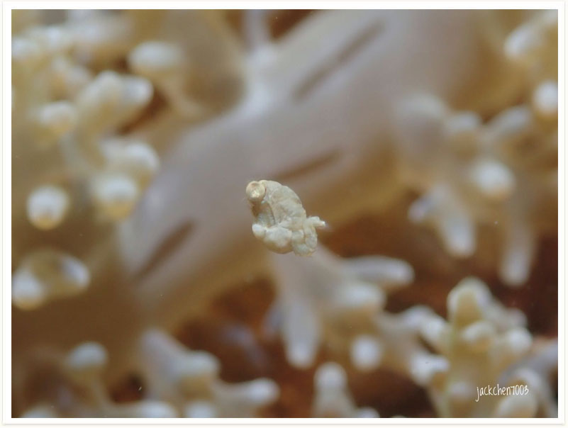
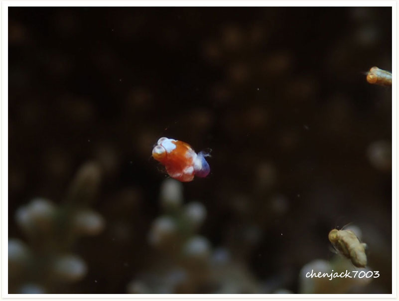

# 65:Idiomysis tsurnamali,Tsurnamali Opossum Shrimp, Mysid Shrimp

#### Chinese name: [豆糠虾](http://www.baidu.com/link?url=qEp3-N7jVCAwrj60z5ZK4l8VHLff0jXmWFWlIeHKuqLQABoyv8MA6l8WoeepppV_Ldd1QqJYnsmCh7JpgxaQKK)

