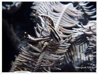

# Shrimp, Crab2

| Thumbnail | Link |
| :---: | :---: |
|   | [51:Lissocarcinus laevis,Harlequin Crab, Harlequin Swimming Crab](51-lissocarcinus-laevis-harlequin-crab-harlequin-swimming-crab.md) |
|   | [52:Lissoporcellana nakasonei,Soft Coral Porcelain Crab](52-lissoporcellana-nakasonei-soft-coral-porcelain-crab.md) |
|   | [53:Loxorhynchus crispatus,Moss Crab, Masking Crab, Decorator Crab](53-loxorhynchus-crispatus-moss-crab-masking-crab-decorator-crab.md) |
|   | [54:Odontonia bagginsi,Ascidian Partner Shrimp](54-odontonia-bagginsi-ascidian-partner-shrimp.md) |
|   | [55:Portunus pelagicus,Flower Crab, Blue Swimmer Crab](55-portunus-pelagicus-flower-crab-blue-swimmer-crab.md) |
|   | [56:Processidae-sp,Night Shrimp](56-processidae-sp-night-shrimp.md) |
|   | [57:Pseudocryptochirus viridis](57-pseudocryptochirus-viridis.md) |
|   | [58:Pycnogonida sp,Sea Spider](58-pycnogonida-sp-sea-spider.md) |
|   | [59:Thenus orientalis,Flathead Lobster,Slipper Lobster](59-thenus-orientalis-flathead-lobster-slipper-lobster.md) |
|   | [60:Calcinus latens,Blue Sock Hermit Crab](60-calcinus-latens-blue-sock-hermit-crab.md) |
|   | [61:Pylopaguropsis lewinsohni ,Hermit Crab](61-pylopaguropsis-lewinsohni-hermit-crab.md) |
|   | [62:Aniculus retipes,Hermit Crab](62-aniculus-retipes-hermit-crab.md) |
|   | [63:Allogalathea elegans,Crinoid Squat Lobster,Feather Star Squat Lobster](63-allogalathea-elegans-crinoid-squat-lobster-feather-star-squat-lobster.md) |
|   | [64:Camposcia retusa,Decorator Crab](64-camposcia-retusa-decorator-crab.md) |

