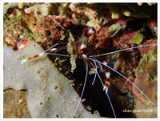
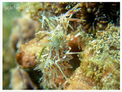
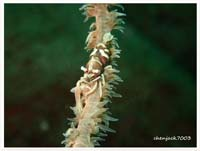
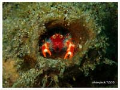

# Shrimp,Crab

| Thumbnail | Link |
| :---: | :---: |
|   | [1: Peacock Mantis Shrimp,Odontodactylus scyllarus](1-peacock-mantis-shrimp.md) |
|   | [2:Hairy Shrimp, Algae Shrimp,Phycocaris simulans](2-hairy-shrimp-algae-shrimp.md) |
|   | [3: Ocellated Tozeuma Shrimp,Tozeuma lanceolatum](3-ocellated-tozeuma-shrimp.md) |
|   | [4: Bubble Coral Shrimp,Vir philippinensis](4-bubble-coral-shrimp.md) |
|   | [5: Coleman\`s shrimp,Periclimenes colemani](5-coleman-shrimp.md) |
|   | [6:Hinge-beak Prawns,Camel Shrimp,Rhynchocinetes uritai](6-dancing-shrimp-camel-shrimp-hingebeak-prawn.md) |
|   | [7: Sarasvati Anemone Shrimp,Ancylomenes sarasvati](7-sarasvati-anemone-shrimp.md) |
|   | [8: Babas Crinoid Squat Lobster,Allogalathea babai](8-elegant-crinoid-squat-lobster.md) |
|   | [9:Yellow Dot Duard Crab, Red Coral Crab,Trapezia cymodoce](9-red-spotted-guard-crab.md) |
|   | [10: Spotted Porcelain Crab,Neopetrolisthes maculatus](10-spotted-porcelain-crab.md) |
|   | [11: Orangutan Crab,Achaeus japonicus](11-orangutan-crab-achaeus-japonicus.md) |
|   | [12: Skeleton Shrimp,Pseudoprotella phasma](12-caprellidae-skeleton-shrimp.md) |
|   | [13: Blue Maxima Clam,Small Giant Clam, Elongate Giant Clam,Tridacna maxima](13-maxima-giant-clam.md) |
|   | [14: Banded Coral Shrimp,Stenopus hispidus](14-banded-coral-shrimp.md) |
|   | [15:Harlequin Shrimp,Hymenocera picta](15-harlequin-shrimp.md) |
|   | [16: Spiny Tiger Shrimp, Bongo Shrimp,Phyllognathia ceratophthalma](16-spiny-tiger-shrimp.md) |
|   | [17: Squat Anemone Shrimp,Thor amboinensis](17-squat-anemone-shrimp-sexy-anemone-shrimp.md) |
|   | [18: Long Nose shrimp, Donald Duck Shrimp,Leander plumosus](18-donald-duck-shrimp-leander-plumosus.md) |
|   | [19: Barrel Sponge Porcelain Crab,Aliaporcellana sp.02](19-aliaporcellana-porcelain-crab.md) |
|   | [20: Emperor shrimp,Zenopontonia rex](20-emperor-shrimp.md) |
|   | [21:Mushroom Coral Shrimp,Cuapetes kororensis](21-mushroom-coral-shrimp-popcorn-shrimp-periclmenes-kororensis-white-head-shrimp.md) |
|   | [22:White-spotted Hermit Crab,Dardanus megistos](22-white-spotted-hermit-shrimp.md) |
|   | [23: Sea Star Shrimp,Zenopontonia soror](23-sea-star-shrimp.md) |
|   | [24: Lisa's Mantis Shrimp​,Lysiosquillina lisa](24-lisas-mantis-shrimp.md) |
|   | [25:Carinate Snapping Shrimp,Synalpheus carinatus](25-soft-coral-snapping-shrimp-synalpheus-neomeris.md) |
|   | [26: Crinoid snapping shrimp,Synalpheus stimpsonii](26-stimpsons-snapping-shrimp-synalpheus-stimpsonii.md) |
|   | [27: Peacocktail Anemone Shrimp,Pacific Clown Anemone Shrimp,Ancylocaris brevicarpalis](27-peacock-tail-anemone-shrimp.md) |
|   | [28: Partner Shrimp, Magnificent Shrimp,Ancylomenes magnificus](28-magnificent-anemone-shrimp.md) |
|   | [29: Pastel Odontodactylid Mantis Shrimp,Odontodactylus cultrifer](29-keel-tail-mantis.md) |
|   | [30:Hydroid Crab, Arrow Crab,Hyastenus bispinosus](30-white-v-hydroid-crab.md) |
|   | [31: Zebra Crab,Zebrida adamsii](31-zebra-urchin-crab.md) |
|   | [32:Disc Anemone Shrimp,Pliopontonia furtiva](32-hidden-corallimorph-shrimp.md) |
|   | [33:Translucent Gorgonian Shrimp,Manipontonia psamathe](1-unknow.md) |
|   | [34:Halimeda Crab,Arrowhead Crab,Huenia heraldica](16-unknow.md) |
|   | [35:Parasit anemone hermit crab,Dardanus pedunculatus](35-parasit-anemone-hermit-crab-dardanus-pedunculatus.md) |
|   | [36:Panulirus versicolor,Painted spiny lobster](36-panulirus-versicolor-painted-spiny-lobster.md) |
|   | [37:Dasycaris zanzibarica,Dasycaris zanzibarica,Zanzibar Whip Coral Shrimp](37-dasycaris-zanzibarica-dasycaris-zanzibarica-zanzibar-whip-coral-shrimp.md) |
|   | [38:Gelastocaris paronae,Cryptic Sponge Shrimp, Paron shrimp](38-gelastocaris-paronae-cryptic-sponge-shrimp-paron-shrimp.md) |
|   | [39:Lauriea siagiani,Pink Squad Lobster, Hairy Squad Lobster](39-lauriea-siagiani-pink-squad-lobster-hairy-squad-lobster.md) |
|   | [40:Hippolyte commensalis,Xenia Soft Coral Shrimp, Hump-backed Shrimp](40-hippolyte-commensalis-xenia-soft-coral-shrimp-hump-backed-shrimp.md) |
|   | [41:Munida olivarae,Olivar's Lobster,Bug-eyed Squat Lobster](41-munida-olivarae-olivars-lobster-bug-eyed-squat-lobster.md) |

